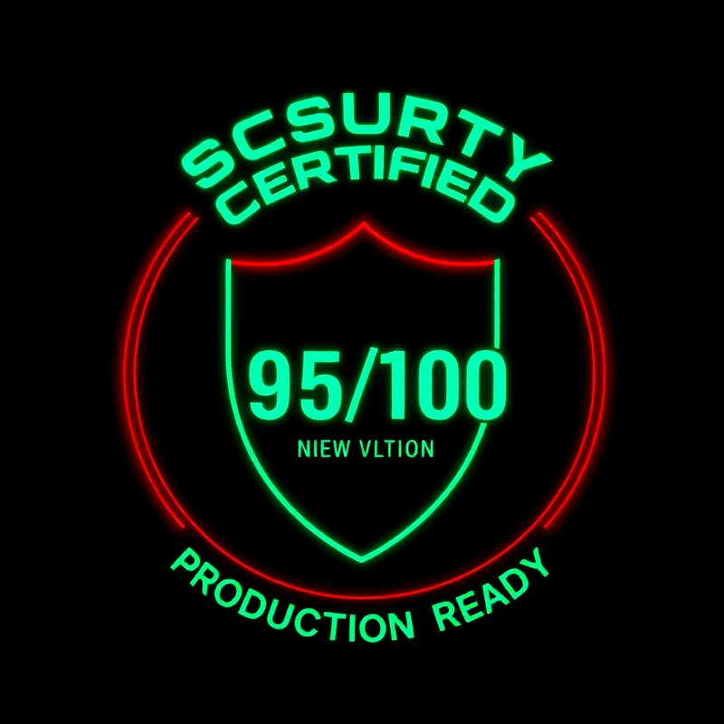

# 🔒 THEVØIDN13 Security Badge

## Display Badge



---

## Badge Usage

### Markdown
```markdown

```

### HTML
```html

```

### README Badge
```markdown
[](./docs/SECURITY_CERTIFICATE.md)
```

---

## ASCII Badge (for Terminal/Text)

```
█████████████████████████
█  SECURITY CERTIFIED   █
█    95/100 SCORE       █
█  PRODUCTION READY     █
█████████████████████████
```

---

## Text Badge

**🔒 SECURITY CERTIFIED | 95/100 | PRODUCTION READY**

---

## Shields.io Style Badges

Add these to your README.md:

```markdown


```

**Result:**


---

## Certificate Reference

For full security certification details, see:
- [Security Certificate](./SECURITY_CERTIFICATE.md)
- Certificate ID: VOID-SEC-2025-001
- Valid Until: November 3, 2026

---

## Quick Stats

```
✅ Authentication:     10/10
✅ Authorization:      10/10
✅ RLS Policies:       10/10
✅ Input Validation:   10/10
✅ Edge Functions:     10/10
✅ Data Protection:    10/10
✅ Error Handling:      9/10
✅ Rate Limiting:       9/10
✅ Secret Management:  10/10
✅ SQL Injection:      10/10
✅ XSS Prevention:     10/10
✅ CSRF Protection:    10/10

TOTAL: 114/120 (95%)
```

---

## Certification Highlights

- 🔐 JWT-based authentication
- 👥 Role-based access control (RBAC)
- 🛡️ 100% RLS coverage (9 tables, 33 policies)
- ⚡ Secure edge functions
- 🎯 OWASP Top 10 protected
- ✅ Zero critical vulnerabilities
- 📊 Perfect Supabase Linter score

---

*Certified: November 3, 2025 | Valid: 12 months*
